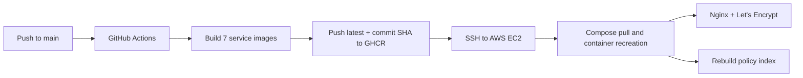

# CampusLink

<p align="center">
  
</p>

<p align="center">
  <strong>One workspace for the campus tasks students handle every day.</strong>
</p>

<p align="center">
  CampusLink brings email, calendars, facilities, lost-and-found, university policies, and everyday utilities into a single Web and Android experience, with a conversational agent that can complete approved actions—not just answer questions.
</p>

<p align="center">
  <a href="https://campuslink.tokeninf.xyz/"></a>
  <a href="https://github.com/t2047/CampusLink/actions/workflows/pr-fast-scan.yml"></a>
  <a href="https://github.com/t2047/CampusLink/actions/workflows/mobile-ci.yml"></a>
  <a href="https://github.com/t2047/CampusLink/actions/workflows/cd-deploy.yml"></a>
  <a href="./LICENSE"></a>
</p>

<p align="center">
  
  
  
  
  
  <a href="./README_cn.md"></a>
</p>

> [!NOTE]
> The public deployment is available at **[campuslink.tokeninf.xyz](https://campuslink.tokeninf.xyz/)**. It runs the production Docker Compose stack on AWS EC2 and is updated by GitHub Actions.

## Table of Contents

- [Why CampusLink](#why-campuslink)
- [Features](#features)
- [Tech Stack](#tech-stack)
- [Architecture](#architecture)
- [Quick Start](#quick-start)
- [Project Structure](#project-structure)
- [Deployment](#deployment)
- [Quality and Testing](#quality-and-testing)
- [Contributing](#contributing)
- [Team Contributions](#team-contributions)
- [License](#license)

## Why CampusLink

Student workflows are usually split across unrelated portals, inboxes, forms, and policy documents. CampusLink provides one authenticated workspace where students can either use dedicated interfaces or ask the campus agent to route a request to the right domain service.

The differentiator is execution with guardrails: CampusLink streams the agent's progress, preserves multi-turn context, and pauses sensitive write operations for explicit human approval before they reach a domain service.

## Features

- ✅ **Conversational campus workspace** — multi-turn chat, token-level SSE streaming, intent routing, multi-agent planning, and response aggregation across domain services.
- ✅ **Human-approved actions** — bookings, reports, claims, mail operations, and other state-changing agent actions use a human-in-the-loop confirmation flow.
- ✅ **Mail and calendar** — each user connects their own Gmail account through OAuth; users can search, read, send, star, archive, and delete mail, manage calendar events, and import events extracted from messages.
- ✅ **Message classification** — email is categorized as campus, career, finance, or other using an LLM-first pipeline with a trained ML fallback.
- ✅ **Campus facilities** — search spaces, check availability, create or cancel bookings, submit maintenance tickets, and track their status; administrators receive operational views and utilization analytics.
- ✅ **Lost and found** — publish lost/found reports with private images, filter and match reports, submit ownership proof, approve or reject claims, receive notifications, and support administrator moderation and audit logs.
- ✅ **Multimodal matching** — Multilingual-E5 text embeddings and CLIP image/cross-modal matching are fused with structured fields; the workflow falls back to baseline matching if the model service is unavailable.
- ✅ **University policy RAG** — retrieve answers from the policy PDFs under `docs/nus_docs/` through LlamaIndex, the shared embedding service, and Qdrant.
- ✅ **Everyday utilities** — calculator, current time, unit and currency conversion, and web/news search are exposed as MCP tools.
- ✅ **Web and native Android clients** — both clients cover the shared account and service experience; Android uses encrypted local persistence and supports local, demo, and production build flavors.
- ✅ **Administrative workspace** — protected `ADMIN`/`SUPER_ADMIN` routes, cross-module KPIs and charts, searchable facilities bookings, maintenance operations, lost-and-found moderation, and a 30-day usage report.

## Tech Stack

| Layer | Technologies | Responsibility |
|---|---|---|
| Web | React 19, TypeScript 6, Vite 8, MUI 7, Nginx | Student/admin UI, SSE chat, same-origin API proxy |
| Android | Kotlin, Jetpack Compose, Room, SQLCipher, OkHttp | Native chat and campus-service client with encrypted local data |
| Backend | Java 21, Spring Boot 4.1, Spring Security, Spring Data JPA, Spring AI MCP | Authentication, domain APIs, authorization, persistence, token exchange |
| Agent orchestration | Python 3.12, FastAPI, LangGraph, LangChain | Intent routing, multi-agent execution, checkpoints, HITL, SSE events |
| Agent protocol | Model Context Protocol (streamable HTTP), JSON Schema | Mail, facilities, lost-and-found, and utility capability contracts |
| AI and retrieval | DeepSeek-compatible API, Multilingual-E5, CLIP, LlamaIndex | Language reasoning, classification, multimodal matching, policy retrieval |
| Data | MySQL 8, MinIO, Qdrant 1.19, SQLite | Business records, private media, vectors, per-user mail/calendar state |
| Delivery | Docker Compose, GHCR, GitHub Actions, AWS EC2, Certbot | Reproducible builds, CI/CD, HTTPS deployment |
| Verification | JUnit 5, pytest, Vitest, Testing Library, Robolectric, Detekt, CodeQL | Unit/integration tests, static analysis, dependency and security scans |

## Architecture


### Security boundaries

| Boundary | Control |
|---|---|
| Browser/mobile → backend | CampusLink JWT and role-based authorization |
| Backend → orchestration | HMAC signature, timestamp, and nonce replay protection |
| Orchestration → domain MCP | Short-lived, audience-scoped RS256 delegation tokens verified through JWKS |
| Agent write operations | Explicit user confirmation before the suspended graph resumes |
| Lost-and-found media | Private MinIO bucket with expiring presigned URLs |
| Gmail | Per-user OAuth tokens; missing OAuth configuration fails closed |

See [communication security](./docs/communication-security.md) and the [Agent interface contract](./docs/AGENT_INTERFACE_NOTICE.md) for the detailed protocol.

## Quick Start

### Prerequisites

| Requirement | Version / guidance |
|---|---|
| Git | Any current version |
| Docker | Docker Desktop or Docker Engine with Compose v2 |
| Memory | 8 GB recommended; the multimodal profile uses an additional 2–3 GB |
| Network | Required on the first build for container images and pretrained model weights |

> [!IMPORTANT]
> The supported setup path is Docker Compose. Java, Node.js, and Python are only needed when developing an individual service outside its container.

### 1. Clone and configure

```bash
git clone https://github.com/t2047/CampusLink.git
cd CampusLink
cp .env.example .env
```

Edit `.env` and replace every development placeholder used by your selected features. The example file is the authoritative list; these groups matter most:

| Variables | Required for |
|---|---|
| `MYSQL_PASSWORD`, `JWT_SECRET`, `SUPER_ADMIN_EMAIL`, `SUPER_ADMIN_PASSWORD` | Database, sign-in, and initial administrator |
| `AGENT_SHARED_SECRET`, `AGENT_BACKEND_SHARED_SECRET`, `LOST_FOUND_CONFIRMATION_SECRET` | Backend/orchestrator and lost-and-found trusted channels |
| `MINIO_ACCESS_KEY`, `MINIO_SECRET_KEY`, `MINIO_BUCKET` | Private image storage |
| `DEEPSEEK_API_KEY` | Main chat routing and facilities planning |
| `GMAIL_CLIENT_ID`, `GMAIL_CLIENT_SECRET` | Per-user Gmail OAuth and mail features |
| `LOST_FOUND_EMBEDDING_SHARED_SECRET` | Multimodal matching and policy RAG |

Generate security values with:

```bash
openssl rand -hex 32
```

> [!WARNING]
> Values in `.env.example` are development placeholders. Never deploy them, commit `.env`, or reuse one secret for multiple production trust boundaries.

### 2. Start the platform

Start the complete delivery stack, including the Lost & Found REST Agent and pretrained multimodal service:

```bash
docker compose --profile agent --profile multimodal \
  up -d --build --wait --wait-timeout 900
```

For a lighter local stack, omit the optional model and REST-Agent profiles. Lost-and-found remains available through its Web/API/MCP path and matching falls back when the model service is absent.

```bash
docker compose up -d --build --wait
```

Build or refresh the university policy index after the embedding service is ready:

```bash
docker compose --profile multimodal run --rm policy-index-builder
```

### 3. Verify

```bash
curl http://localhost:8080/actuator/health
curl http://localhost:8000/health
curl http://localhost:5000/health
docker compose ps
```

| Endpoint | Purpose |
|---|---|
| `https://localhost` | Containerized Web application |
| `http://localhost:8080` | Spring Boot API |
| `http://localhost:8000/health` | Orchestration health |
| `http://localhost:5000` | Mail service and local OAuth callback |
| `http://localhost:9001` | MinIO development console |
| `http://localhost:6333/dashboard` | Qdrant development dashboard |

> [!TIP]
> The local Nginx container redirects HTTP to HTTPS and generates a self-signed development certificate. A browser warning on first access is expected. Production uses Let's Encrypt.

To stop the stack without deleting persisted data:

```bash
docker compose --profile agent --profile multimodal down
```

Named volumes are retained. Add `--volumes` only when you intentionally want to erase local databases, object storage, vectors, keys, and mail/calendar state.

### Android build

The `demo` flavor connects to the public deployment; the `local` flavor connects an emulator to the local backend.

```bash
cd frontend_mobile
./gradlew testDemoDebugUnitTest lintDemoDebug detekt assembleDemoDebug
```

See the [Android README](./frontend_mobile/README.md) for release signing and build-flavor details.

## Project Structure

```text
CampusLink/
├── agent/
│   ├── chat_core/              # FastAPI + LangGraph orchestration and SSE
│   ├── facilities_agent/       # Facilities intent planning and domain adapter
│   ├── lost_found_agent/       # Lost-and-found rules, LLM parsing, tools, MCP gateway
│   ├── mail_agent/             # Gmail, calendar, classifier, and mail agent service
│   ├── mcp_servers/            # Mail/facilities/utility MCP servers and policy RAG
│   ├── schemas/                # Versioned Agent capability contracts
│   └── shared/                 # Shared security primitives
├── backend/                    # Spring Boot API, auth, chat relay, facilities, lost-and-found
├── frontend_web/               # React student/admin workspace and production Nginx image
├── frontend_mobile/            # Native Android application
├── services/
│   └── lost_found_embedding/   # Multilingual-E5 and CLIP inference service
├── deploy/                     # Environment preparation and HTTPS bootstrap
├── docs/                       # Architecture, security, domain, and RAG documentation
├── .github/workflows/          # CI, security scans, Android release, and EC2 CD
├── docker-compose.yml          # Development/full-stack service graph
├── docker-compose.prod.yml     # GHCR image overrides for production
└── DEPLOYMENT.md               # Detailed AWS EC2 runbook
```

## Deployment

Production uses immutable GHCR images and a single AWS EC2 host running Docker Compose.



### Production baseline

- Ubuntu host with Docker Engine and Compose v2
- Recommended minimum: 2 vCPU, 8 GB RAM, 30 GB storage
- Inbound ports: `22`, `80`, and `443` only
- Repository checked out at `/opt/campuslink`
- Production `.env` created from `.env.prod.example`
- `REGISTRY=ghcr.io/<github-owner>` configured on the host

Create a production environment file with generated secrets:

```bash
python deploy/prepare_env.py
```

Configure these GitHub Actions secrets:

| Secret | Purpose |
|---|---|
| `VM_HOST`, `VM_USER`, `VM_SSH_KEY` | EC2 SSH deployment |
| `CERT_DOMAIN`, `CERT_EMAIL` | Let's Encrypt certificate issuance and renewal |
| `GMAIL_CLIENT_ID`, `GMAIL_CLIENT_SECRET` | Optional CI-managed Gmail OAuth configuration |
| `GMAIL_PROJECT_ID` | Optional Google Cloud project metadata |

Every push to `main` runs `.github/workflows/cd-deploy.yml`, builds seven application images, publishes both `latest` and commit-SHA tags to GHCR, updates the EC2 checkout, pulls the new images, starts the `agent` and `multimodal` profiles, bootstraps HTTPS, and refreshes the policy index.

The equivalent host command is:

```bash
docker compose -f docker-compose.yml -f docker-compose.prod.yml \
  --profile agent --profile multimodal \
  up -d --pull always --wait --wait-timeout 900
```

To deploy a specific immutable build, set `TAG` to a published commit SHA before running the same command.

> [!CAUTION]
> Keep `.env`, Gmail credentials, SSH keys, JWT secrets, and service-to-service secrets outside Git. The production security group should not expose MySQL, MinIO, Qdrant, embedding, or MCP ports to the public Internet.

For server initialization, certificate bootstrap, health checks, backup notes, and troubleshooting, follow [DEPLOYMENT.md](./DEPLOYMENT.md).

## Quality and Testing

The repository contains backend, Web, Python, and Android test suites. Pull requests run fast CI, while scheduled workflows add broader security and model smoke checks.

```bash
# Backend
cd backend
./mvnw test -DskipDependencyCheck=true -Dspotbugs.skip=true

# Web
cd ../frontend_web
npm ci
npm run lint
npm test
npm run build

# Android
cd ../frontend_mobile
./gradlew testDemoDebugUnitTest lintDemoDebug detekt assembleDemoDebug
```

| Workflow | Scope |
|---|---|
| `pr-fast-scan.yml` | Backend/Web/Agent checks, dependency review, and fast security gates |
| `mobile-ci.yml` | Android unit tests, lint, Detekt, and build |
| `mail-calendar-ci.yml` | Mail/calendar tests, lint, audit, image build, and CodeQL |
| `multimodal-model-smoke.yml` | Pretrained model integration smoke test |
| `nightly-full-scan.yml` | Extended scheduled security scan |
| `android-release.yml` | Signed Android release workflow |

## Contributing

Contributions are welcome. Keep changes scoped to one domain and include the verification that proves the behavior.

1. Fork the repository and create a branch such as `feat/facilities-filter` or `fix/mail-oauth-state`.
2. Read the domain documentation under `docs/` and the nearest module README before changing an interface.
3. Add or update tests in the affected backend, Web, Python, or Android suite.
4. Use focused, conventional commit messages such as `feat(lost-found): add claim filter`.
5. Open a pull request describing the user-visible change, security impact, configuration changes, and commands used to verify it.

When changing an Agent interface, update the matching JSON capability declaration under `agent/schemas/` and review the [Agent interface contract](./docs/AGENT_INTERFACE_NOTICE.md).

## Team Contributions

| Contributor | Git identities | Contribution areas |
|---|---|---|
| TAO Yuchen | `t2047`, `TAO Yuchen` | Project initialization and the overall Agent/MCP architecture, capability schemas, inter-service security, and Spring Security/JWT role foundation; Chat Core–Web integration, SSE/multi-turn/HITL orchestration, cross-domain Agent/tool integration, and policy RAG; DevSecOps and delivery, including fast PR/nightly scans, dependency and Android Release workflows, Docker/GHCR CI/CD, and automated AWS EC2 deployment with Nginx/Certbot HTTPS. |
| Zhao Lei | `COKEiiii` | Basic full-stack Lost & Found workflow—publishing `LOST`/`FOUND` reports, browsing, filtering, and details, excluding Claim/admin features; explainable Multilingual-E5 + CLIP matching with structured scoring and fallback; native Kotlin/Compose mobile frontend excluding Facilities, covering authentication, Core Chat, encrypted history, Lost & Found, mobile Claim UI integration, Mail/Calendar, navigation, bilingual UI, and dark mode. |
| JIA QIANRUI | `BeforeLanding` | Complete Claim lifecycle from ownership-proof submission through administrator approve/reject review and notifications; Agent image staging to MinIO with fingerprints/embeddings and image-based Browse search; Personal Center with profile/avatar updates, password change and JWT invalidation, plus aggregated claims/reports. |
| Xuhan Zhang | `zhangxuhan75-eng` | Full-stack Facilities System—search, booking/cancellation, conflict detection, maintenance, status tracking, role-based management, database integration, and authorization; Facilities Agent/MCP workflow, context, confirmations, date/time parsing, and tool/result integration; shared Android feature integration and UI/UX, Facilities Web/API integration, plus authentication, permission, Chat Core/MCP, and cross-module regression testing. |
| Wu Tianzhuo | `TonyWu`, `TonyWu2333` | Full-stack Gmail OAuth mail module across FastAPI, Web, MCP, and LangChain Agent; LLM-first email classification with scikit-learn fallback; per-user SQLite calendar CRUD, message-to-schedule extraction/import, and Web calendar; OAuth secret/redirect hardening, timezone-stable tests, container/production wiring, and dedicated security CI. |
| Liu Zhuocheng | `lilfizz22` | Web Admin Dashboard foundation with protected routes, responsive layouts, navigation, module entry points, and error pages; Lost & Found administration with live metrics, claim filtering, evidence/details, approvals, conflict handling, and API integration; cross-module KPIs, charts, monitoring tables, Facilities administration APIs, and the 30-day Administrative Usage Report. |
| Cai Hanbo | `Mx-May` | Admin Facilities Dashboard with overview statistics, booking search/filtering, maintenance management, sorting/pagination, and supporting Spring Boot dynamic queries; workspace navigation, page layouts, return flows, full-height forms, and CampusLink brand identity; bilingual Facilities FAQ, cross-module navigation consistency, shared pagination, and server-side filtered aggregation. |

Commit counts are intentionally omitted because aliases, merge commits, and pair work make raw totals a poor measure of contribution.

## Documentation

| Document | Purpose |
|---|---|
| [Deployment guide](./DEPLOYMENT.md) | AWS EC2, Compose, GHCR, HTTPS, and operations |
| [Architecture](./docs/ARCHITECTURE_cn.md) | System-level component design |
| [Communication security](./docs/communication-security.md) | HMAC, delegation tokens, JWKS, and trust boundaries |
| [Facilities module](./docs/facilities/README.md) | Domain rules, APIs, MCP tools, and tests |
| [Mail service](./agent/mail_agent/README.md) | Gmail OAuth, calendar, classification, and mail Agent |
| [Policy RAG](./docs/policy_rag.md) | Index construction, Qdrant, and retrieval behavior |
| [Lost & Found local reproduction](./docs/lost-found/LOCAL_REPRODUCTION_cn.md) | End-to-end module verification |
| [Android client](./frontend_mobile/README.md) | Build flavors, local development, and release signing |

## License

CampusLink is released under the [MIT License](./LICENSE).
