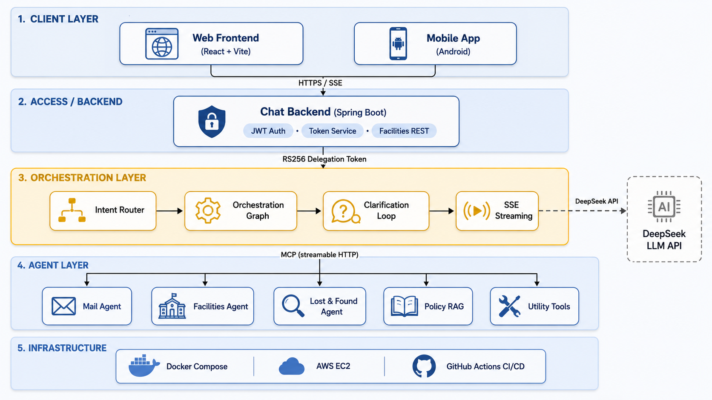
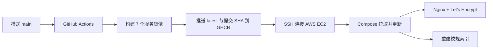

# CampusLink

<p align="center">
  
</p>

<p align="center">
  <strong>把大学生日常要处理的校园事务，放进同一个工作台。</strong>
</p>

<p align="center">
  CampusLink 将邮件、日历、校园设施、失物招领、校规检索和常用工具整合到 Web 与 Android 端，并通过可执行任务的对话式 Agent，把分散在门户、收件箱、表单和文档中的流程串联起来。
</p>

<p align="center">
  <a href="https://campuslink.tokeninf.xyz/"></a>
  <a href="https://github.com/t2047/CampusLink/actions/workflows/pr-fast-scan.yml"></a>
  <a href="https://github.com/t2047/CampusLink/actions/workflows/mobile-ci.yml"></a>
  <a href="https://github.com/t2047/CampusLink/actions/workflows/cd-deploy.yml"></a>
  <a href="./LICENSE"></a>
</p>

<p align="center">
  
  
  
  
  
  <a href="./README.md"></a>
</p>

> [!NOTE]
> 线上环境位于 **[campuslink.tokeninf.xyz](https://campuslink.tokeninf.xyz/)**，以生产 Docker Compose 栈运行在 AWS EC2，并由 GitHub Actions 持续部署。

## 目录

- [为什么选择 CampusLink](#为什么选择-campuslink)
- [核心特性](#核心特性)
- [技术栈](#技术栈)
- [系统架构](#系统架构)
- [快速上手](#快速上手)
- [项目结构](#项目结构)
- [生产部署](#生产部署)
- [质量保障](#质量保障)
- [贡献指南](#贡献指南)
- [团队分工](#团队分工)
- [许可证](#许可证)

## 为什么选择 CampusLink

大学生往往需要在互不相通的门户、邮箱、表单与政策文档之间切换。CampusLink 提供统一的认证工作台：用户既可以直接使用各业务页面，也可以让校园 Agent 识别意图，并把请求交给正确的领域服务。

项目的核心差异不是“再做一个聊天框”，而是受控执行：系统流式展示 Agent 进度、保留多轮上下文，并在敏感写操作到达业务服务前暂停流程，等待用户明确确认。

## 核心特性

- ✅ **对话式校园工作台** — 支持多轮会话、Token 级 SSE 流式输出、意图路由、多 Agent 规划与跨领域结果聚合。
- ✅ **人工确认后执行** — 预约、报失、认领、邮件操作等会改变状态的 Agent 动作，通过 HITL 流程获得用户确认。
- ✅ **邮件与日历** — 每位用户通过 OAuth 绑定自己的 Gmail，可搜索、阅读、发送、加星、归档和删除邮件，管理日历，并导入从邮件提取的日程。
- ✅ **邮件智能分类** — 通过“大模型优先、训练好的 ML 模型兜底”的流水线，将邮件归入校园、职业、财务或其他类别。
- ✅ **校园设施** — 搜索空间、查询空闲时段、创建或取消预约、提交维修工单并跟踪状态；管理员可查看运营列表和利用率分析。
- ✅ **失物招领** — 发布带私有图片的遗失/拾获记录，筛选与匹配物品，提交所有权证明，审批认领，接收通知，并支持管理员审核和审计日志。
- ✅ **多模态匹配** — 将 Multilingual-E5 文本向量、CLIP 图片/跨模态向量与结构化字段融合；模型服务不可用时自动降级到基础匹配。
- ✅ **校规 RAG** — 通过 LlamaIndex、共享向量服务和 Qdrant，从 `docs/nus_docs/` 的政策 PDF 中检索答案。
- ✅ **常用工具** — 通过 MCP 提供计算器、当前时间、单位与货币换算、网页及新闻搜索。
- ✅ **Web 与原生 Android** — 两端共享账号和校园服务体验；Android 使用加密本地存储，并提供 local、demo、prod 三种构建变体。
- ✅ **管理工作台** — 提供受保护的 `ADMIN`/`SUPER_ADMIN` 路由、跨模块 KPI 与图表、设施预约检索、维修运营、失物招领审核和 30 天使用报告。

## 技术栈

| 层级 | 技术 | 职责 |
|---|---|---|
| Web | React 19、TypeScript 6、Vite 8、MUI 7、Nginx | 学生/管理界面、SSE 对话、同源 API 代理 |
| Android | Kotlin、Jetpack Compose、Room、SQLCipher、OkHttp | 原生校园服务客户端与加密本地数据 |
| 后端 | Java 21、Spring Boot 4.1、Spring Security、Spring Data JPA、Spring AI MCP | 认证、领域 API、鉴权、持久化、令牌兑换 |
| Agent 编排 | Python 3.12、FastAPI、LangGraph、LangChain | 意图路由、多 Agent 执行、检查点、HITL、SSE 事件 |
| Agent 协议 | Model Context Protocol（Streamable HTTP）、JSON Schema | 邮件、设施、失物招领、工具能力契约 |
| AI 与检索 | DeepSeek 兼容 API、Multilingual-E5、CLIP、LlamaIndex | 语言推理、分类、多模态匹配、政策检索 |
| 数据 | MySQL 8、MinIO、Qdrant 1.19、SQLite | 业务数据、私有媒体、向量、用户邮件/日历状态 |
| 交付 | Docker Compose、GHCR、GitHub Actions、AWS EC2、Certbot | 可复现构建、CI/CD、HTTPS 部署 |
| 验证 | JUnit 5、pytest、Vitest、Testing Library、Robolectric、Detekt、CodeQL | 单元/集成测试、静态分析、依赖和安全扫描 |

## 系统架构



### 安全边界

| 边界 | 控制措施 |
|---|---|
| 浏览器/移动端 → 后端 | CampusLink JWT 与基于角色的权限控制 |
| 后端 → 编排层 | HMAC 签名、时间戳、Nonce 防重放 |
| 编排层 → 领域 MCP | 短时效、受众隔离的 RS256 委托令牌，通过 JWKS 验证 |
| Agent 写操作 | 挂起执行图，用户明确确认后恢复 |
| 失物招领图片 | 私有 MinIO Bucket 与限时预签名 URL |
| Gmail | 每用户独立 OAuth Token；OAuth 配置缺失时拒绝执行 |

详细协议见[通信安全说明](./docs/communication-security.md)与 [Agent 接口契约](./docs/AGENT_INTERFACE_NOTICE.md)。

## 快速上手

### 前置条件

| 要求 | 版本或建议 |
|---|---|
| Git | 当前稳定版本 |
| Docker | Docker Desktop，或带 Compose v2 的 Docker Engine |
| 内存 | 建议 8 GB；多模态 profile 会额外占用约 2–3 GB |
| 网络 | 首次构建需拉取容器镜像和预训练模型权重 |

> [!IMPORTANT]
> 官方启动路径是 Docker Compose。仅在脱离容器开发单个服务时，才需要自行安装 Java、Node.js 或 Python。

### 1. 克隆并配置

```bash
git clone https://github.com/t2047/CampusLink.git
cd CampusLink
cp .env.example .env
```

编辑 `.env`，替换所选功能涉及的所有开发占位值。完整且权威的变量清单位于 `.env.example`，其中最重要的配置组如下：

| 环境变量 | 用途 |
|---|---|
| `MYSQL_PASSWORD`、`JWT_SECRET`、`SUPER_ADMIN_EMAIL`、`SUPER_ADMIN_PASSWORD` | 数据库、登录与初始管理员 |
| `AGENT_SHARED_SECRET`、`AGENT_BACKEND_SHARED_SECRET`、`LOST_FOUND_CONFIRMATION_SECRET` | 后端/编排层及失物招领可信通道 |
| `MINIO_ACCESS_KEY`、`MINIO_SECRET_KEY`、`MINIO_BUCKET` | 私有图片存储 |
| `DEEPSEEK_API_KEY` | 主对话路由与设施规划 |
| `GMAIL_CLIENT_ID`、`GMAIL_CLIENT_SECRET` | 每用户 Gmail OAuth 与邮件功能 |
| `LOST_FOUND_EMBEDDING_SHARED_SECRET` | 多模态匹配与校规 RAG |

生成安全随机值：

```bash
openssl rand -hex 32
```

> [!WARNING]
> `.env.example` 中的值仅供开发占位。不得将它们用于生产环境，不得提交 `.env`，也不要让多个生产信任边界共用同一个密钥。

### 2. 启动平台

启动完整交付栈，包括 Lost & Found REST Agent 与预训练多模态服务：

```bash
docker compose --profile agent --profile multimodal \
  up -d --build --wait --wait-timeout 900
```

如果本地资源有限，可省略可选的模型和 REST Agent profiles。失物招领的 Web/API/MCP 主链路仍然可用，模型服务缺失时匹配会自动降级。

```bash
docker compose up -d --build --wait
```

向量服务就绪后，构建或刷新校规索引：

```bash
docker compose --profile multimodal run --rm policy-index-builder
```

### 3. 验证

```bash
curl http://localhost:8080/actuator/health
curl http://localhost:8000/health
curl http://localhost:5000/health
docker compose ps
```

| 地址 | 用途 |
|---|---|
| `https://localhost` | 容器化 Web 应用 |
| `http://localhost:8080` | Spring Boot API |
| `http://localhost:8000/health` | 编排层健康检查 |
| `http://localhost:5000` | 邮件服务与本地 OAuth 回调 |
| `http://localhost:9001` | MinIO 开发控制台 |
| `http://localhost:6333/dashboard` | Qdrant 开发控制台 |

> [!TIP]
> 本地 Nginx 会把 HTTP 重定向到 HTTPS，并自动生成自签名开发证书。首次访问出现浏览器证书提示属于正常现象；生产环境使用 Let's Encrypt。

停止容器但保留持久化数据：

```bash
docker compose --profile agent --profile multimodal down
```

命名卷不会被删除。只有明确需要清空本地数据库、对象存储、向量、密钥和邮件/日历状态时，才应添加 `--volumes`。

### Android 构建

`demo` 变体连接公开部署，`local` 变体通过模拟器连接本地后端。

```bash
cd frontend_mobile
./gradlew testDemoDebugUnitTest lintDemoDebug detekt assembleDemoDebug
```

发布签名和构建变体说明见 [Android 中文文档](./frontend_mobile/README_cn.md)。

## 项目结构

```text
CampusLink/
├── agent/
│   ├── chat_core/              # FastAPI + LangGraph 编排与 SSE
│   ├── facilities_agent/       # 设施意图规划与领域适配
│   ├── lost_found_agent/       # 规则、LLM 解析、工具与 MCP 网关
│   ├── mail_agent/             # Gmail、日历、分类器与邮件 Agent
│   ├── mcp_servers/            # 邮件/设施/工具 MCP 与校规 RAG
│   ├── schemas/                # 版本化 Agent 能力契约
│   └── shared/                 # 共享安全组件
├── backend/                    # Spring Boot API、认证、对话转发、设施、失物招领
├── frontend_web/               # React 学生/管理工作台与生产 Nginx 镜像
├── frontend_mobile/            # 原生 Android 应用
├── services/
│   └── lost_found_embedding/   # Multilingual-E5 与 CLIP 推理服务
├── deploy/                     # 环境生成与 HTTPS 初始化
├── docs/                       # 架构、安全、领域与 RAG 文档
├── .github/workflows/          # CI、安全扫描、Android 发布与 EC2 CD
├── docker-compose.yml          # 开发/全栈服务编排
├── docker-compose.prod.yml     # 生产 GHCR 镜像覆盖
└── DEPLOYMENT.md               # AWS EC2 详细运维手册
```

## 生产部署

生产环境使用不可变 GHCR 镜像，并在单台 AWS EC2 上运行 Docker Compose。



### 生产基线

- 安装 Docker Engine 与 Compose v2 的 Ubuntu 主机
- 建议最低配置：2 vCPU、8 GB 内存、30 GB 存储
- 仅开放入站端口 `22`、`80`、`443`
- 仓库检出到 `/opt/campuslink`
- 从 `.env.prod.example` 创建生产 `.env`
- 主机配置 `REGISTRY=ghcr.io/<github-owner>`

生成带随机密钥的生产环境文件：

```bash
python deploy/prepare_env.py
```

在 GitHub Actions 中配置：

| Secret | 用途 |
|---|---|
| `VM_HOST`、`VM_USER`、`VM_SSH_KEY` | EC2 SSH 部署 |
| `CERT_DOMAIN`、`CERT_EMAIL` | Let's Encrypt 证书签发与续期 |
| `GMAIL_CLIENT_ID`、`GMAIL_CLIENT_SECRET` | 可选：由 CI 管理 Gmail OAuth 配置 |
| `GMAIL_PROJECT_ID` | 可选：Google Cloud 项目标识 |

每次推送到 `main` 都会触发 `.github/workflows/cd-deploy.yml`：构建 7 个应用镜像，将 `latest` 与提交 SHA 标签推送到 GHCR，更新 EC2 上的代码，拉取镜像，以 `agent` 和 `multimodal` profiles 启动服务，初始化 HTTPS，并刷新政策索引。

服务器上的等价命令是：

```bash
docker compose -f docker-compose.yml -f docker-compose.prod.yml \
  --profile agent --profile multimodal \
  up -d --pull always --wait --wait-timeout 900
```

需要部署某个不可变历史版本时，将 `TAG` 设置为已发布的提交 SHA，再执行相同命令。

> [!CAUTION]
> `.env`、Gmail 凭据、SSH 私钥、JWT 密钥和服务间密钥必须留在 Git 之外。生产安全组不得向公网开放 MySQL、MinIO、Qdrant、Embedding 或 MCP 端口。

服务器初始化、证书签发、健康检查、备份注意事项与故障排查见 [DEPLOYMENT.md](./DEPLOYMENT.md)。

## 质量保障

仓库包含后端、Web、Python 和 Android 测试套件。Pull Request 执行快速门禁，定时工作流补充完整安全扫描和模型冒烟验证。

```bash
# 后端
cd backend
./mvnw test -DskipDependencyCheck=true -Dspotbugs.skip=true

# Web
cd ../frontend_web
npm ci
npm run lint
npm test
npm run build

# Android
cd ../frontend_mobile
./gradlew testDemoDebugUnitTest lintDemoDebug detekt assembleDemoDebug
```

| 工作流 | 覆盖范围 |
|---|---|
| `pr-fast-scan.yml` | 后端/Web/Agent 检查、依赖审查和快速安全门禁 |
| `mobile-ci.yml` | Android 单元测试、Lint、Detekt 与构建 |
| `mail-calendar-ci.yml` | 邮件/日历测试、Lint、依赖审计、镜像构建与 CodeQL |
| `multimodal-model-smoke.yml` | 预训练模型集成冒烟测试 |
| `nightly-full-scan.yml` | 定时完整安全扫描 |
| `android-release.yml` | Android 签名发布 |

## 贡献指南

欢迎参与贡献。每次改动应聚焦一个领域，并附带能够证明行为正确的验证。

1. Fork 仓库并创建分支，例如 `feat/facilities-filter` 或 `fix/mail-oauth-state`。
2. 修改接口前，先阅读 `docs/` 下对应领域文档和最近的模块 README。
3. 在受影响的后端、Web、Python 或 Android 测试套件中添加或更新测试。
4. 使用明确的 Conventional Commit，例如 `feat(lost-found): add claim filter`。
5. 提交 Pull Request，说明用户可见变化、安全影响、配置变化和实际执行过的验证命令。

修改 Agent 接口时，需要同步更新 `agent/schemas/` 下对应的 JSON 能力声明，并检查 [Agent 接口契约](./docs/AGENT_INTERFACE_NOTICE.md)。

## 团队分工

| 成员 | Git 身份 | 贡献领域 |
|---|---|---|
| TAO Yuchen | `t2047`、`TAO Yuchen` | 项目初始化与 Agent/MCP 总体架构、能力 Schema、服务间安全及 Spring Security/JWT 角色基础；Chat Core 与 Web 集成、SSE/多轮/HITL 编排、跨领域 Agent/工具及政策 RAG；DevSecOps 与交付，包括 PR 快速/夜间扫描、依赖与 Android Release 工作流、Docker/GHCR CI/CD，以及使用 Nginx/Certbot HTTPS 的 AWS EC2 自动部署。 |
| Zhao Lei | `COKEiiii` | 失物招领基础全栈流程，包括发布 `LOST`/`FOUND`、浏览、筛选和详情（不含 Claim 与管理员功能）；以 Multilingual-E5、CLIP、结构化评分和降级策略构建可解释匹配；负责除 Facilities 外的 Kotlin/Compose 移动端，包括认证、Core Chat、加密历史、失物招领、移动端 Claim UI 集成、邮件/日历、导航、双语和深色模式。 |
| JIA QIANRUI | `BeforeLanding` | 从所有权证明提交到管理员批准/拒绝及通知的完整 Claim 生命周期；Agent 图片暂存到 MinIO、视觉指纹/向量生成和 Browse 以图搜图；个人中心的资料/头像更新、修改密码与 JWT 失效，以及个人认领和报告聚合。 |
| Xuhan Zhang | `zhangxuhan75-eng` | 设施全栈系统，包括搜索、预约/取消、冲突检测、维修、状态跟踪、角色管理、数据库集成和后端鉴权；Facilities Agent/MCP 工作流、上下文、确认、日期时间解析及工具/结果集成；Android 共享功能与 UI/UX、Facilities Web/API 集成，以及认证、权限、Chat Core/MCP 和跨模块回归测试。 |
| Wu Tianzhuo | `TonyWu`、`TonyWu2333` | 覆盖 FastAPI、Web、MCP 与 LangChain Agent 的 Gmail OAuth 邮件全栈模块；大模型优先、scikit-learn 兜底的邮件分类；每用户 SQLite 日历 CRUD、邮件日程提取/导入和 Web 日历；OAuth 密钥与回调加固、跨时区稳定测试、容器/生产接线及独立安全 CI。 |
| Liu Zhuocheng | `lilfizz22` | Web 管理端基础，包括受保护路由、响应式布局、导航、模块入口和错误页；失物招领管理的实时指标、认领筛选、证据/详情、审批、冲突处理与 API 集成；跨模块 KPI、图表、运营表格、设施管理 API 和 30 天管理员使用报告。 |
| Cai Hanbo | `Mx-May` | 设施管理仪表盘，包括概览统计、预约检索/筛选、维修管理、排序分页及 Spring Boot 动态查询；工作台导航、页面布局、返回流程、全高表单和 CampusLink 品牌标识；双语设施 FAQ、跨模块导航一致性、共享分页及服务端筛选聚合。 |

未直接列出提交数量，因为别名、合并提交和协作开发会让原始计数失去代表性。

## 延伸文档

| 文档 | 内容 |
|---|---|
| [部署指南](./DEPLOYMENT.md) | AWS EC2、Compose、GHCR、HTTPS 与运维 |
| [系统架构](./docs/ARCHITECTURE_cn.md) | 系统级组件设计 |
| [通信安全](./docs/communication-security.md) | HMAC、委托令牌、JWKS 与信任边界 |
| [设施模块](./docs/facilities/README.md) | 领域规则、API、MCP 工具与测试 |
| [邮件服务](./agent/mail_agent/README.md) | Gmail OAuth、日历、分类与邮件 Agent |
| [政策 RAG](./docs/POLICY_RAG_GUIDE_cn.md) | 索引构建、Qdrant 与检索行为 |
| [失物招领本地复现](./docs/lost-found/LOCAL_REPRODUCTION_cn.md) | 模块端到端验证 |
| [Android 客户端](./frontend_mobile/README_cn.md) | 构建变体、本地开发与发布签名 |

## 许可证

CampusLink 使用 [MIT License](./LICENSE) 开源。

